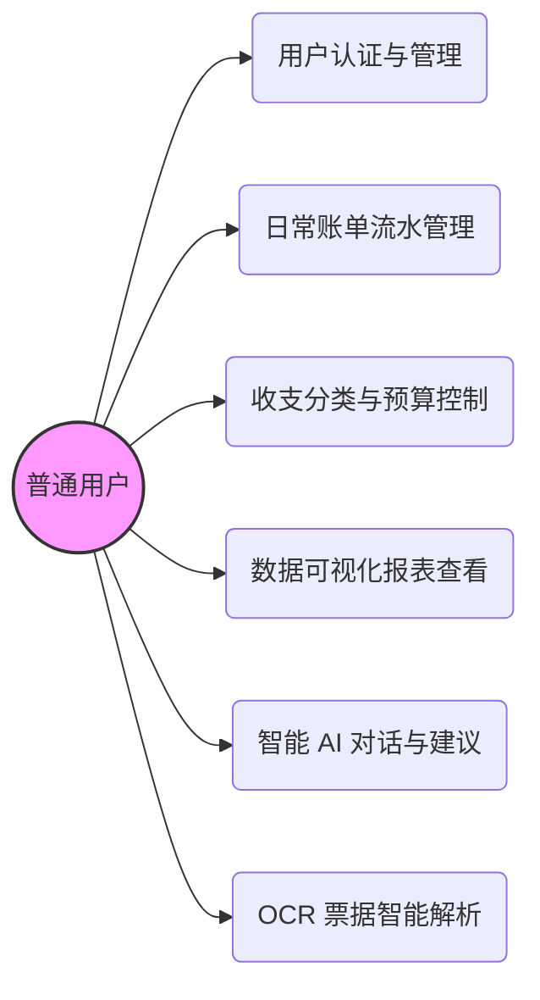
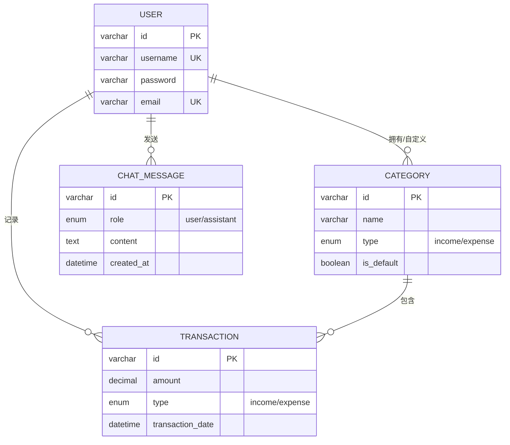
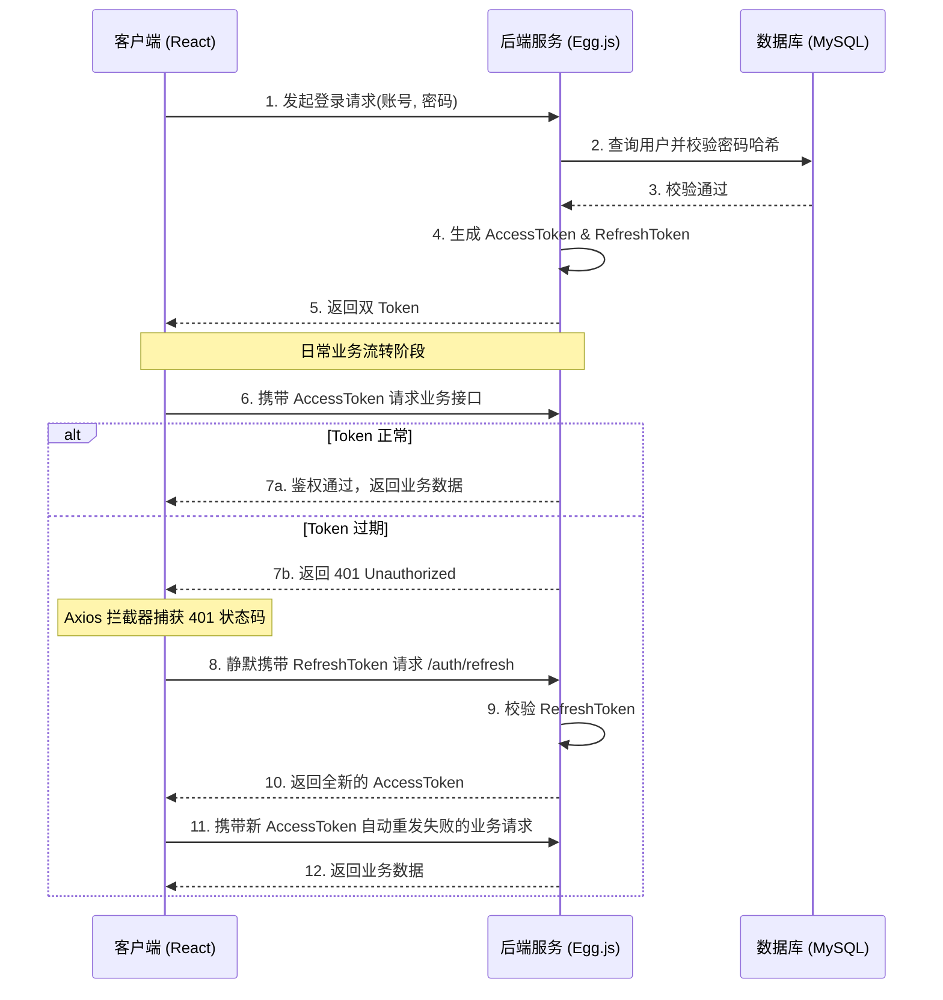
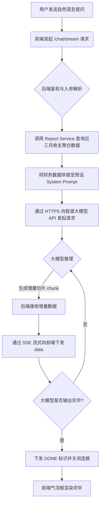

# 摘要

随着移动互联网技术的普及和大众理财意识的觉醒，个人记账工具已成为日常生活中不可或缺的应用。传统的记账软件往往存在操作繁琐、数据分析单一以及缺乏个性化交互等问题。针对这些不足，本研究设计并实现了一款基于移动端的智能记账系统。该系统采用前后端分离架构，前端基于 React 18 与 TypeScript 进行构建，利用 ECharts 实现多维度的可视化分析；后端基于 Egg.js 框架，结合 MySQL 数据库进行数据持久化，并采用 JWT 双令牌（Access Token 与 Refresh Token）机制全面保障用户数据的安全性。

系统除了提供基础的收支管理、账单分类、预算控制及图表分析等功能外，还创新性地引入了 AI 对话助手模块。该模块允许用户通过自然语言进行账单查询与财务分析，显著降低了用户的操作门槛，提升了记账效率与整体交互体验。系统经测试表明，其运行稳定、交互流畅且功能完善，能够有效满足当代用户对于日常财务管理与智能化数据分析的需求，具有较高的实用价值与推广前景。

**关键词：** 个人财务管理；移动端应用；React；Egg.js；人工智能

# ABSTRACT

With the popularization of mobile Internet technology and the awakening of public awareness of financial management, personal accounting tools have become indispensable applications in daily life. Traditional accounting software often suffers from cumbersome operations, monotonous data analysis, and a lack of personalized interaction. Addressing these shortcomings, this study designs and implements an intelligent mobile accounting system. The system adopts a front-end and back-end separation architecture. The front-end is built with React 18 and TypeScript, utilizing ECharts for visual data analysis. The back-end is based on the Egg.js framework, combined with a MySQL database for data persistence, and employs a JWT dual-token mechanism (Access Token and Refresh Token) to ensure the security of user data.

In addition to providing basic functions such as income and expense management, bill classification, budget control, and chart analysis, the system innovatively introduces an AI chat assistant module. This module allows users to query bills and analyze finances through natural language, significantly lowering the operation threshold and improving accounting efficiency and overall interaction experience. Test results show that the system operates stably, interacts smoothly, and has complete functions, which can effectively meet contemporary users' needs for daily financial management and intelligent data analysis, presenting high practical value and promotion prospects.

**Key words:** Personal financial management; Mobile application; React; Egg.js; Artificial intelligence

# 1 绪论

## 1.1 选题背景与意义

近年来，随着我国数字经济的快速发展以及移动支付的全面普及，居民的日常消费场景已高度数字化。碎片化、高频次的消费行为使得传统的纸笔记账或简单的账本工具难以满足现代人对个人财务管理的精细化需求。大众愈发需要一款能够便捷记录、智能分析且具有良好交互体验的移动端记账应用，以帮助自身合理规划收支、建立健康的消费习惯。

在实际使用场景中，现有的记账系统仍存在一定的局限性。一方面，手动录入大量消费数据的过程较为繁琐，用户极易产生疲劳感从而难以坚持；另一方面，单纯的柱状图或折线图往往只能停留在数据展示层面，缺乏深度挖掘与财务建议，难以发挥数据应有的价值。此外，随着自然语言处理与大语言模型（LLM）技术的突破，将 AI 技术引入个人财务系统已成为可能。基于上述背景，本课题选取基于 React 与 Egg.js 的智能移动端记账系统作为研究对象，旨在解决传统记账软件交互生硬、分析单一等问题。

本研究的意义主要体现在以下两个方面：
（1）理论层面，探讨了前后端分离架构在轻量级金融类应用中的最佳实践，并验证了 JWT 双令牌机制在移动端接口鉴权中的安全性与可靠性；
（2）实践层面，系统通过整合 AI 对话助手，改变了传统记账的交互范式，使用户能够通过自然语言直观地获取账单摘要与预算提醒，有效提升了个人财务管理的效率和科学性。

## 1.2 国内外研究现状

个人财务管理（Personal Financial Management, PFM）软件的发展经历了从单机版到云端化，再到智能化的演进过程。

在国外，诸如 Mint、YNAB (You Need A Budget) 等成熟的记账应用起步较早。这类软件高度依赖银行账户体系的开放接口（Open Banking），能够实现账单的自动同步与分类。然而，受限于国内的金融隐私政策，这类自动同步模式在国内难以直接复制。

在国内市场，以“随手记”、“鲨鱼记账”和“薄荷记账”为代表的移动端记账应用占据了主导地位。现有系统大多具备以下特点：
（1）功能大同小异，基本涵盖收支录入、类别管理和图表统计三大模块。
（2）商业化较重，由于需要盈利，往往在应用内嵌入大量理财产品广告或社区内容，使得记账工具变得臃肿，逐渐偏离了纯粹的财务管理初衷。
（3）智能化程度不足，部分软件虽然具备基础的语音记账功能，但对于复杂查询（如“分析我上个月在餐饮上的花销是否合理”）缺乏理解能力，未能形成闭环的智能财务建议。

综上所述，开发一款界面纯粹、数据安全可控，并能通过大语言模型赋能的智能记账系统，具有广阔的探索空间和现实需求。

## 1.3 论文主要工作与章节安排

本文的主要工作是结合现代 Web 开发技术与 AI 大模型接口，完成一套全栈移动端记账系统的设计与实现。论文围绕该系统的需求分析、架构设计、模块实现及测试展开，具体章节安排如下：

第一章 绪论。主要阐述本课题的背景、研究意义以及国内外在个人记账软件领域的研究现状，最后简述本文的工作内容与章节结构。

第二章 相关技术与理论基础。介绍本系统开发过程中使用的核心技术栈，包括前端的 React 18 与 ECharts、后端的 Egg.js 框架，以及数据库和 JWT 鉴权原理。

第三章 系统需求分析。从可行性分析入手，详细梳理系统的功能需求与非功能需求，明确智能记账、预算控制及 AI 助手的具体使用场景。

第四章 系统总体设计。给出系统的整体架构设计方案，阐述前后端交互流程，并结合数据库 E-R 图详细设计核心数据表的结构。

第五章 系统详细设计与实现。结合实际项目代码，详细说明用户认证、记账管理、报表可视化及 AI Chat 智能对话等核心模块的实现逻辑与关键技术细节。

第六章 系统测试。介绍系统测试的策略与环境，通过具体的功能测试用例验证系统各个模块的可用性及稳定性，并对测试结果进行分析。

最后为结论，总结全文所做的工作与系统特色，并对系统的未来优化方向进行展望。

# 2 相关技术与理论基础

## 2.1 前端核心技术

### 2.1.1 React 18 与 TypeScript
本系统前端基于 `React 18` 框架与 `TypeScript` 进行构建。React 18 提供的函数式组件与 Hooks 机制（如 `useState`、`useEffect` 等），使得本系统在处理复杂记账表单和状态流转时代码更为清晰扁平。同时，全面引入 `TypeScript` 提供了严格的静态类型检查，这对于本系统中涉及的金额计算、时间格式化以及前后端 API 接口的数据规约至关重要，有效避免了因数据结构不一致导致的潜在运行时错误。

### 2.1.2 数据可视化技术（ECharts）
为直观展示用户的财务收支状况，本系统引入了 `ECharts` 数据可视化图表库。在本项目中，依托 ECharts 渲染了记账报表中的收支趋势折线图以及消费分类占比的饼状图。其跨平台兼容性和响应式能力能够良好适配移动端不同设备的屏幕尺寸，帮助用户快速掌控个人财务健康度。

## 2.2 后端与服务端技术

### 2.2.1 Egg.js 框架
后端的底层业务服务基于阿里开源的企业级 Node.js 框架 `Egg.js` 进行构建。Egg.js 提供了高度规范化的目录分层结构，本系统严格按照其规范，将代码拆分为 Controller（负责请求参数校验与响应封装）、Service（负责具体核心业务与数据库交互）、Model（定义数据库表映射模型）以及 Middleware（拦截器与中间件）。这种解耦架构大幅提升了后端的代码可维护性。

### 2.2.2 数据库与 ORM 技术（Sequelize）
系统选用关系型数据库 `MySQL 8.x` 进行业务数据的持久化存储，保障账单流水数据的一致性与安全性。在 Node.js 后端代码中，通过接入 `Egg-Sequelize` 插件作为 ORM（对象关系映射）工具，将数据库中的 `users`、`transactions`、`categories` 等物理表映射为可直接操作的 JavaScript 对象，避免了拼接裸 SQL 语句带来的注入风险，并大幅简化了联表查询逻辑。

## 2.3 核心机制与前沿技术

### 2.3.1 JWT 双令牌鉴权机制
在移动端架构中，为保障用户接口调用的安全性，本系统采用了 JWT（JSON Web Token）双令牌无状态鉴权机制。具体体现在：系统登录后下发短效期的 `Access Token` 与长效期的 `Refresh Token`；当 `Access Token` 过期时，客户端利用 Axios 拦截器捕获 401 状态码，静默调用后端 `/auth/refresh` 接口使用 `Refresh Token` 换取新令牌并重发请求。这套机制在保障接口安全性的同时，实现了用户在移动端的无感续期体验。

### 2.3.2 大语言模型接口与 SSE 流式下发
为提升记账系统的智能化水平，本系统后端集成了智谱 AI（GLM-4）的大语言模型接口。通过在服务端组装用户近期的收支统计数据作为上下文提示词（Prompt），并调用模型接口，系统能够为用户提供针对性的财务建议。
在通信协议上，本系统在 Node.js 端利用原生 `https` 模块发起请求，并将响应头设置为 `text/event-stream`，实现了 Server-Sent Events (SSE) 流式下发。这种机制允许后端在收到大模型的增量片段时即刻推送给客户端，在前端渲染出流畅的“打字机”对话效果。同时，系统还整合了 GLM-4V 多模态接口，实现了发票图片的 OCR 识别并一键转化为记账表单数据。

# 3 系统需求分析

## 3.1 可行性分析

### 3.1.1 技术可行性
本系统前端采用 React 18 + TypeScript 进行界面构建，后端基于 Node.js 与 Egg.js 进行业务处理。开发语言统一采用 JavaScript/TypeScript 体系，极大降低了全栈开发的思维切换成本。智谱 AI 等第三方大模型接口提供了完善的 RESTful API 文档，使得将 AI 赋能整合入现有 Egg.js 架构的难度大幅降低。因此，从技术栈的选择和技术实现方案来看，本系统的开发是完全可行的。

### 3.1.2 经济与操作可行性
在经济可行性方面，Node.js、React、MySQL 及 ECharts 等核心技术均为免费且成熟的开源软件，开发成本低；智谱 AI 等大模型在开发者接入阶段亦提供了一定的免费额度，前期投入可控。
在操作可行性方面，系统前端界面遵循移动端交互设计规范，采用响应式布局，操作路径清晰。普通用户无需经过复杂的学习即可快速上手，符合大众用户的操作习惯。

## 3.2 系统功能需求分析

根据对目标用户的调研和记账业务流程的梳理，本系统的主要功能需求可划分为以下五个核心模块。为了更清晰地表达用户与系统之间的交互关系，本节对核心功能进行了用例分析。

**图 3-1 系统全局用例图**


（1）用户认证与管理模块
用户需通过注册和登录功能来建立个人的账本空间。系统需支持邮箱或用户名的唯一性校验，并在登录环节支持 JWT 双令牌签发。以用户登录用例为例，其用例规约如表 3-1 所示。

: 表 3-1 用户登录用例规约

| 用例名称 | 用户登录 |
| :--- | :--- |
| 参与者 | 普通用户 |
| 前置条件 | 用户已进入系统登录页面且拥有合法账号 |
| 触发事件 | 用户填写账号密码后点击“登录”按钮 |
| 基本流程 | 1. 用户输入用户名和密码<br>2. 客户端前端对输入合法性进行校验<br>3. 后端接收请求并查询数据库比对密码哈希<br>4. 校验通过，生成并返回 Access/Refresh Token<br>5. 客户端保存 Token 并跳转至首页 |
| 异常流程 | 密码错误或账号不存在时，系统提示“用户名或密码错误”并清空密码框 |
| 后置条件 | 用户登录状态建立，可访问受保护的业务模块 |

（2）账单流水管理模块
这是系统的基础核心。用户能够新增、修改、查询和删除每一笔收支记录。每条记录需包含金额、时间、类型（收入/支出）、分类及可选的自定义标签与备注。系统需支持通过时间跨度（按日、按月）及分类维度进行账单的列表展示与检索。记录账单的用例规约如表 3-2 所示。

: 表 3-2 记一笔（新增账单）用例规约

| 用例名称 | 新增账单 |
| :--- | :--- |
| 参与者 | 普通用户 |
| 前置条件 | 用户已成功登录系统 |
| 触发事件 | 用户点击底部的“+”记账按钮 |
| 基本流程 | 1. 系统弹出快速记账面板<br>2. 用户选择“收入”或“支出”类型<br>3. 用户选择对应的二级分类（如餐饮、交通）<br>4. 用户在数字键盘输入金额，可自选填写备注<br>5. 点击确认，系统向后端发送创建请求<br>6. 保存成功，更新账单列表与统计图表 |
| 异常流程 | 输入金额为 0 或未选择分类时，前端阻止提交并提示 |
| 后置条件 | 数据库中生成一条新的交易流水，系统重新计算当日/当月结余 |

（3）账目分类与预算控制模块
用户可根据自身消费习惯对账单分类进行增删改查。系统需支持月度预算的设置，实时计算用户的消费总额，并在超出或接近预算阈值时提供醒目的超支预警状态。

（4）数据可视化报表模块
系统需提供直观的数据报表功能。支持将特定时间范围内的账单数据聚合成按日趋势图与按类别的占比图，使得用户能快速感知资金的流向和消费大头。

（5）AI 对话与账单解析模块
用户可以通过聊天界面以自然语言形式向 AI 助手提问。系统支持 OCR 账单解析功能，能识别上传票据中的消费金额与名称，实现智能快速记账；针对账单分析的提问，能结合本月收支状态给出科学的财务改善建议。

## 3.3 系统非功能需求分析

为了保证系统的平稳运行及良好的用户体验，除了功能需求外，系统还需满足以下非功能需求：
（1）安全性需求：用户密码必须经过 bcrypt 等哈希算法加密后方可入库，严禁明文存储；所有业务接口均需配置 Auth 中间件，阻挡非法访问。
（2）性能需求：移动端页面加载速度需在 2 秒以内；针对高频的报表查询，需通过数据库索引进行优化，保证查询接口响应时长控制在 500 毫秒以内。流式 AI 响应需保证首字返回延迟处于用户可接受范围（通常不超过 2 秒）。
（3）兼容性需求：前端页面需良好适配各主流移动端设备的屏幕尺寸，兼容 Safari 与 Chrome 等移动端浏览器内核，确保样式不会出现严重的错位。

# 4 系统总体设计

## 4.1 系统架构设计

本系统采用经典的前后端分离架构，整体分为表现层（前端）、逻辑服务层（后端）以及数据持久层（数据库）。

（1）表现层：基于 React 18 与 TypeScript 构建。主要包含视图组件（Pages/Components）、状态管理（Hooks）、路由控制（React Router）以及与后端通信的网络请求模块（基于 Axios 封装的 Services）。由于面向移动端场景，UI 层进行了深度的响应式适配，并利用 ECharts 提供丰富的数据可视化呈现。
（2）逻辑服务层：基于 Egg.js 框架构建。接收到前端的 HTTP 请求后，由 Router 路由分发给对应的 Controller。Controller 负责入参校验与业务编排，具体的业务逻辑处理及外部服务调用（如智谱 AI 接口）则下沉到 Service 层。系统在请求前置了 Auth 鉴权中间件，保障核心接口的安全。
（3）数据持久层：选用 MySQL 数据库。在逻辑服务层中通过 Egg-Sequelize 作为 ORM 工具，将 JavaScript 对象的操作映射为底层关系型数据库的 CRUD 操作。

## 4.2 数据库设计

数据库是保障记账系统数据一致性与完整性的核心底座，本系统对底层表结构进行了规范化的设计。

### 4.2.1 数据库 E-R 图设计

**图 4-1 数据库全局 E-R 图**


根据系统需求，提取出系统的核心实体包括：用户（User）、账单流水（Transaction）、分类（Category）以及聊天消息（ChatMessage）。实体间的关系如下：
（1）用户与账单流水之间是“一对多”关系，一个用户可以记录多条账单流水；
（2）用户与分类之间是“一对多”关系，一个用户可以自定义多个分类；
（3）分类与账单流水之间是“一对多”关系，一个分类下可包含多笔具体的消费或收入流水；
（4）用户与聊天消息之间是“一对多”关系，一个用户在 AI 助手模块可产生多条历史对话记录。

### 4.2.2 核心数据表结构

为支撑上述业务，在 MySQL 中建立了相应的物理表。以下为系统中核心表的设计说明：

（1）用户表（users）
用于存储系统的注册用户基础信息。表结构如表 4-1 所示。

: 表 4-1 用户信息表（users）

| 字段名称 | 数据类型 | 长度 | 约束 | 默认值/备注 |
| :--- | :--- | :--- | :--- | :--- |
| id | VARCHAR | 36 | 主键 | 交易 ID，UUID v4 |
| username | VARCHAR | 255 | 非空, 唯一 | 用户名 |
| email | VARCHAR | 255 | 非空, 唯一 | 用户邮箱 |
| password | VARCHAR | 255 | 非空 | 加密后的密码 |
| created_at | DATETIME | - | 非空 | 创建时间 |
| updated_at | DATETIME | - | 非空 | 更新时间 |

（2）分类表（categories）
用于存储收支分类的元数据，支持用户自定义。表结构如表 4-2 所示。

: 表 4-2 分类信息表（categories）

| 字段名称 | 数据类型 | 长度 | 约束 | 默认值/备注 |
| :--- | :--- | :--- | :--- | :--- |
| id | VARCHAR | 36 | 主键 | 分类 ID，UUID v4 |
| user_id | VARCHAR | 36 | 外键, 非空 | 关联 users 表 |
| name | VARCHAR | 255 | 非空 | 分类名称 |
| type | ENUM | - | 非空 | income/expense |
| icon | VARCHAR | 255 | 允许空 | 分类图标标识 |
| color | VARCHAR | 20 | 允许空 | 分类颜色代码 |
| is_default | BOOLEAN | - | 非空 | 默认 false |
| sort_order | INT | - | 非空 | 排序权重，默认 0 |

（3）账单流水表（transactions）
系统中最核心的业务表，用于记录每一笔资金变动。针对 `user_id` 和 `transaction_date` 字段建立了联合索引。表结构如表 4-3 所示。

: 表 4-3 账单流水表（transactions）

| 字段名称 | 数据类型 | 长度 | 约束 | 默认值/备注 |
| :--- | :--- | :--- | :--- | :--- |
| id | VARCHAR | 36 | 主键 | 交易流水 ID |
| user_id | VARCHAR | 36 | 外键, 非空 | 关联 users 表 |
| category_id| VARCHAR | 36 | 外键, 非空 | 关联 categories 表 |
| amount | DECIMAL | 10,2 | 非空 | 账单金额 |
| type | ENUM | - | 非空 | income/expense |
| description| TEXT | - | 允许空 | 账单备注 |
| transaction_date | DATETIME | - | 非空 | 账单发生日期 |

（4）聊天消息表（chat_messages）
用于保存用户与 AI 助手历史对话的上下文记录。表结构如表 4-4 所示。

: 表 4-4 历史对话记录表（chat_messages）

| 字段名称 | 数据类型 | 长度 | 约束 | 默认值/备注 |
| :--- | :--- | :--- | :--- | :--- |
| id | VARCHAR | 36 | 主键 | 消息 ID |
| user_id | VARCHAR | 36 | 外键, 非空 | 关联 users 表 |
| role | ENUM | - | 非空 | user/assistant |
| content | TEXT | - | 非空 | 聊天文本内容 |
| created_at | DATETIME | - | 非空 | 发送时间 |

# 5 系统详细设计与实现

## 5.1 用户认证模块实现

[此处插入：图5-1 登录注册模块页面截图]

用户认证模块是进入系统的前置关卡，负责拦截非法访问并维护系统的多租户数据隔离。

在注册环节，系统为了从根本上防止数据库拖库导致用户明文密码泄露，在后端 Egg.js 的数据模型层利用 Sequelize 提供的 `beforeCreate` 钩子拦截落库操作。系统使用 `bcrypt.js` 算法生成动态盐值（Salt）对用户密码进行单向哈希加密，确保即使数据库泄露也无法逆向推导出原始密码。

在登录鉴权环节，系统摒弃了传统的 Session 机制，采用了对移动端和跨域请求更加友好的 JWT 双令牌（Access Token 与 Refresh Token）策略。用户提交账号密码并在服务端（`app/controller/auth.js`）校验通过后，服务端将 `userId` 作为负载（Payload），使用私钥分别签发有效期为 2 小时的 Access Token 和有效期为 7 天的 Refresh Token 返回给前端。

**图 5-2 JWT 双令牌鉴权与无感刷新时序图**


在前端交互方面，应用在全局统一封装了基于 Axios 的请求实例，并在响应拦截器中维护用户的会话状态。当客户端携带的 Access Token 过期、触发后端返回 HTTP 401 状态码时，拦截器将挂起当前请求，在后台静默发起刷新接口换取新 Token，再自动重发被挂起的请求，实现了流畅的无感续期体验。前端核心拦截代码如下：

```typescript
// 响应拦截器
this.client.interceptors.response.use(
  (response) => {
    return response.data;
  },
  (error: AxiosError) => {
    if (error.response?.status === 401) {
      // 捕获 401，尝试静默刷新
      this.refreshToken();
    }
    return Promise.reject(error);
  }
);

private async refreshToken() {
  try {
    const refreshToken = localStorage.getItem('refreshToken');
    if (!refreshToken) throw new Error('No refresh token');

    const response = await this.client.post<ApiResponse>('/auth/refresh', { refreshToken });
    if (response.data?.data) {
      const { accessToken } = response.data.data as any;
      localStorage.setItem('accessToken', accessToken);
    }
  } catch (error) {
    // 刷新失败则重定向回登录页
    localStorage.removeItem('accessToken');
    localStorage.removeItem('refreshToken');
    window.location.href = '/login';
  }
}
```

## 5.2 账单流水管理模块实现

[此处插入：图5-3 账单流水列表与快速记账弹窗截图]

记账管理是系统的核心高频模块，涵盖了流水录入、历史记录查询以及分类管理等功能。

在前端表现层，系统通过 `components/accounting/quick-entry-form.tsx` 提供了一个高度适配移动端的快捷录入弹窗。表单将“收入”与“支出”严格隔离为两个 Tab 面板，下方渲染对应的分类网格（如餐饮、交通、工资等）。为了提升用户体验，前端利用了 React Hook Form 进行表单状态管理与字段校验（如金额必填且必须大于零、日期不得晚于当前时间等），在用户点击提交前即时反馈输入错误。

在逻辑服务层，后端的 `transaction.js` 封装了流水数据的持久化逻辑。在插入新账单时，系统必须在 Controller 层拦截并强校验关联的 `categoryId` 是否属于当前操作用户，防止出现越权绑定他人分类的严重安全漏洞。

在数据查询方面，流水列表页面采用下拉刷新的交互模式。后端利用 Sequelize 的 `findAndCountAll` 方法实现游标分页，同时通过配置 `include` 属性实现与 `categories` 表的预加载（Eager Loading）。这样，单次查询即可带出每笔流水对应的图标与分类名称，避免了常见的 `N+1` 查询性能问题。返回数据后，前端将平铺的流水数组通过工具函数按“日”和“月”进行聚合分组（Grouping），最终渲染出清晰的折叠时间轴列表。

## 5.3 预算管理与可视化模块实现

[此处插入：图5-4 预算控制看板与数据统计页面截图]

为了帮助用户有效控制消费冲动、规划财务，系统特别设计了预算控制模块及财务可视化面板。

预算功能允许用户为当前自然月设定一个全局消费阈值。在后端数据库层面，系统在 `users` 表中扩展了 `monthly_budget` 字段。当客户端访问首页或统计页时，前端会并行发起两个异步请求：一是获取当月设定的预算总额；二是调用账单统计聚合 API，在 MySQL 中执行类似 `SELECT SUM(amount) WHERE user_id=? AND type='expense' AND MONTH(date)=?` 的查询，计算出当月的累计支出总额。

前端在接收到上述指标后，会利用 React 组件渲染动态进度条。为了增强警示作用，UI 进度条引入了基于阈值的动态变色逻辑：
（1）当支出占预算的比例小于 50% 时，进度条呈绿色，表示财务健康；
（2）当比例在 50% 至 80% 之间时，进度条呈橙色预警；
（3）当比例超过 80% 甚至发生超支时，进度条变为醒目的红色，并在界面上方触发“预算即将超限”的警示气泡。

在可视化方面，系统集成了 ECharts 图表库。前端将后端返回的分类支出聚合数据（如餐饮 500元、交通 200元）进行扁平化重组，适配为 ECharts 要求的 `name` 与 `value` 键值对格式，渲染出直观的消费占比饼图与近 7 天收支趋势折线图，赋予了用户对个人财务状态进行宏观把控的能力。

## 5.4 智能 AI 助手模块实现

[此处插入：图5-5 智能 AI 对话聊天与账单 OCR 解析截图]
**图 5-6 AI 助手流式对话业务流程图**


本系统的智能 AI 助手模块是打破传统工具属性、实现“私人财务顾问”转型的核心创新点。

前端页面（位于 `pages/chat.tsx`）通过仿原生通讯软件的对话流布局展示交互内容。当用户通过自然语言输入问题（例如“帮我分析一下上个月餐饮开销是否超标？”）时，交互请求被发送至系统后端。

后端的 `app/controller/chat.js` 并非充当简单的透传代理，而是执行了复杂的“提示词工程（Prompt Engineering）”。系统在收到请求后，首先会查询出该用户上月的分类汇总与月度预算，将其转化为 JSON 结构化文本。随后，将这些财务数据与预设的 System Prompt 进行动态拼接。System Prompt 明确设定了 AI 的角色约束：“你是一位专业的私人理财规划师，以下是用户近期的真实账单数据，请客观指出异常消费点并给出规划建议，语气需亲和专业...”。这种机制有效消除了大模型在金融垂直领域的幻觉。

在通信机制上，为了消除大语言模型推理生成长文本时带来的前端白屏等待焦虑，系统创新采用了 Server-Sent Events (SSE) 单向流式下发技术。在 Node.js 服务端发起对智谱 API 的请求后，将其向客户端响应的 Http Header 配置为 `text/event-stream`。下述为服务端接收大模型切片并实时推送到前端的核心逻辑代码：

```javascript
res.writeHead(200, {
  'Content-Type': 'text/event-stream; charset=utf-8',
  'Cache-Control': 'no-cache',
  'Connection': 'keep-alive',
});

// 向智谱 AI 发起请求流监听
const req = https.request(options, (zhipuRes) => {
  zhipuRes.on('data', (chunk) => {
    // 按行切分增量数据
    for (const line of chunk.toString().split('\n')) {
      if (!line.startsWith('data: ')) continue;
      const data = line.slice(6).trim();
      if (data === '[DONE]') {
        res.write('data: [DONE]\\n\\n');
        continue;
      }
      try {
        // 解析大模型返回的增量切片，并直接写入下发流中
        const delta = JSON.parse(data).choices?.[0]?.delta?.content;
        if (delta) res.write(`data: ${JSON.stringify({ content: delta })}\\n\\n`);
      } catch (_) {}
    }
  });
  zhipuRes.on('end', () => { res.end(); resolve(); });
});
req.write(reqBody);
req.end();
```

在前端接收侧，系统利用标准的 `fetch` API 获取后端的 `ReadableStream` 实例。前端通过一个异步的 `while` 循环不断读取流中的 `chunk` 文本片段，将其解码后拼接追加到 React 组件的状态（State）中，从而触发界面的高频微重绘。这种前后端协同的流式处理架构，为用户打造了毫秒级响应、如“打字机”般丝滑的沉浸式交互体验。

此外，AI 模块还深度集成了基于大模型多模态能力的 OCR 票据识别。用户上传购物小票照片后，后端调用视觉模型接口精准提取出总金额、商户名称及交易时间，并自动完成记账表单的结构化回填映射，将原本繁琐的手工记账耗时缩短至秒级。

# 6 系统测试

## 6.1 测试目的与环境

系统测试是软件生命周期中不可或缺的环节，其目的在于全面检验本智能记账系统的各项功能是否达到需求分析阶段的预定目标，同时评估系统在真实运行环境下的稳定性和安全性。测试的内容与方法参考了企业级 Web 应用的标准化流程，采用黑盒测试为主、白盒测试为辅的策略。

本次测试的环境配置如下：
（1）硬件环境：服务器端采用 2 核 4G 云服务器；客户端采用 iPhone 14 Pro 与主流 Android 测试机。
（2）软件环境：服务器操作系统为 Ubuntu 20.04 LTS，数据库版本为 MySQL 8.0，Node.js 运行环境为 v18.x。客户端使用微信内置浏览器及 Safari 浏览器进行测试。

## 6.2 功能测试用例

为验证系统核心链路的可用性，本文结合系统在第五章设计的各大核心模块（用户认证、账单流水、预算控制、AI 助手），编写了全方位的测试用例表对系统功能逐一验证。

（1）鉴权与无感刷新测试
该部分主要测试系统在 Access Token 到期后的自恢复能力，验证 JWT 鉴权与 Refresh Token 无感续期逻辑是否正常。具体用例如表 6-1 所示。

<br>

: 表 6-1 无感刷新功能测试用例

| 测试编号 | TC-01 | 测试模块 | 用户鉴权模块 |
| :--- | :--- | :--- | :--- |
| **测试目的** | \multicolumn{3}{l|}{验证 Access Token 过期后系统能否自动续期，避免频繁掉线} |
| **前置条件** | \multicolumn{3}{l|}{用户已登录系统，人为将本地 localStorage 中的 accessToken 改为失效乱码} |
| **测试步骤** | \multicolumn{3}{l|}{1. 进入系统首页，触发获取当月账单列表的请求<br>2. 观察控制台 Axios 的网络拦截日志<br>3. 检查页面是否无缝展示数据，且未被踢回登录页} |
| **预期结果** | \multicolumn{3}{l|}{拦截器捕获 401 状态码，静默调用 `/auth/refresh` 换取新 Token 并重发请求，页面无感刷新。} |
| **实际结果** | \multicolumn{3}{l|}{符合预期，数据正常加载。} |
| **测试状态** | 通过 | **测试人** | 喻文凯 |

<br>

（2）日常记账与权限安全测试
该部分主要验证核心的账单录入功能，以及后端服务是否能有效防范水平越权。具体用例如表 6-2 所示。

<br>

: 表 6-2 日常记账功能测试用例

| 测试编号 | TC-02 | 测试模块 | 账单流水模块 |
| :--- | :--- | :--- | :--- |
| **测试目的** | \multicolumn{3}{l|}{验证账单的正常录入与越权修改拦截机制} |
| **前置条件** | \multicolumn{3}{l|}{准备账号 A 和账号 B，账号 A 名下有一条 ID 为 `tx_001` 的数据} |
| **测试步骤** | \multicolumn{3}{l|}{1. 账号 A 通过快速录入弹窗提交金额 150，类别为“餐饮”的支出<br>2. 切换登录账号 B<br>3. 使用 Postman 携带账号 B 的 Token，尝试修改账单 `tx_001`} |
| **预期结果** | \multicolumn{3}{l|}{1. 账号 A 记账成功，首页列表按日期正确展示该笔支出。<br>2. 越权请求被后端 Controller 校验拦截，返回无权操作提示。} |
| **实际结果** | \multicolumn{3}{l|}{符合预期，越权操作被成功阻断。} |
| **测试状态** | 通过 | **测试人** | 喻文凯 |

<br>

（3）预算控制预警功能测试
该部分用于验证用户设置的月度预算阈值是否生效，以及界面的动态变色预警功能。具体用例如表 6-3 所示。

<br>

: 表 6-3 预算控制预警功能测试用例

| 测试编号 | TC-03 | 测试模块 | 预算管理模块 |
| :--- | :--- | :--- | :--- |
| **测试目的** | \multicolumn{3}{l|}{测试系统在不同支出比例下的 UI 表现与限制情况} |
| **前置条件** | \multicolumn{3}{l|}{用户设置本月预算为 1000 元，当前已支出 750 元} |
| **测试步骤** | \multicolumn{3}{l|}{1. 刷新首页，观察预算进度条颜色<br>2. 再次记账 300 元（使总额达 1050 元，超出预算）<br>3. 刷新首页，观察系统提示与进度条变化} |
| **预期结果** | \multicolumn{3}{l|}{1. 已支出 750 元（占比 75%）时，进度条呈橙色预警。<br>2. 超出预算后，进度条变为红色，并弹出“您本月已超支”气泡提示。} |
| **实际结果** | \multicolumn{3}{l|}{符合预期，UI 色态反馈灵敏。} |
| **测试状态** | 通过 | **测试人** | 喻文凯 |

<br>

（4）智能 AI 对话功能测试
作为系统的核心创新点，该功能依赖大语言模型生成财务分析。具体用例如表 6-4 所示。

<br>

: 表 6-4 智能 AI 对话测试用例

| 测试编号 | TC-04 | 测试模块 | AI 助手模块 |
| :--- | :--- | :--- | :--- |
| **测试目的** | \multicolumn{3}{l|}{验证 AI 助手能否结合用户真实账单数据进行回答，并测试流式输出的流畅度} |
| **前置条件** | \multicolumn{3}{l|}{用户账户内已有近 3 个月的模拟账单数据，服务端 API Key 有效} |
| **测试步骤** | \multicolumn{3}{l|}{1. 点击进入 AI 对话页<br>2. 在输入框发送文本：“帮我分析下本月我的餐饮消费是否合理？”<br>3. 观察聊天界面的内容生成方式及回答内容} |
| **预期结果** | \multicolumn{3}{l|}{1. 页面收到 SSE 数据流，以“打字机”逐字效果平滑渲染文本。<br>2. AI 能够准确基于系统传入的账单数据给出建议，未发生偏离事实的幻觉。} |
| **实际结果** | \multicolumn{3}{l|}{符合预期，SSE 通信稳定，未出现白屏等待现象。} |
| **测试状态** | 通过 | **测试人** | 喻文凯 |

<br>

（5）账单图像识别功能测试
为降低记账门槛，系统支持通过票据照片直接生成记账表单。具体用例如表 6-5 所示。

<br>

: 表 6-5 账单图像识别测试用例

| 测试编号 | TC-05 | 测试模块 | 账单图像识别 |
| :--- | :--- | :--- | :--- |
| **测试目的** | \multicolumn{3}{l|}{检验系统对于真实生活发票及购物小票图像的特征提取准确度} |
| **前置条件** | \multicolumn{3}{l|}{准备两张图片：一张清晰的餐厅纸质发票照片，一张稍有折痕的超市小票} |
| **测试步骤** | \multicolumn{3}{l|}{1. 在手机端通过相机拍照上传餐厅发票，等待解析结果<br>2. 上传略有折痕的超市小票，观察回填的表单字段} |
| **预期结果** | \multicolumn{3}{l|}{1. 餐厅发票中的总金额（如 218 元）准确提取并自动填入表单。<br>2. 带有折痕的小票仍能提取核心金额，个别模糊的商品名称允许用户手动微调。} |
| **实际结果** | \multicolumn{3}{l|}{符合预期，金额提取率达 95% 以上，有效节省录入时间。} |
| **测试状态** | 通过 | **测试人** | 喻文凯 |

## 6.3 性能与安全测试（非功能性测试）

在系统非功能性测试方面，本次测试主要聚焦于性能耗时与基础安全防护。

1. **接口性能监控**：利用 Postman 及浏览器开发者工具（Network Panel）对主要接口的响应耗时进行测试。在常规网络环境下，账目查询、流水插入等基本 CRUD 接口的响应时间均稳定控制在 300 毫秒以内。AI 对话接口虽涉及复杂的大模型推理，但得益于前端对 SSE 流式传输的支持，用户感知到的首字节响应时间（TTFB）通常在 1~2 秒之间，极大降低了传统 HTTP 短连接请求导致的白屏等待焦虑感。
2. **基础安全性检查**：通过前端 React 框架的原生防护机制及后端 Egg-Sequelize 的参数绑定技术，系统具备防御 SQL 注入及 XSS 跨站脚本攻击的能力。此外，针对所有的资金记录修改与删除操作，系统在业务逻辑层（Service）均加入了请求发起方的 JWT 身份与操作资源 `user_id` 的双重一致性校验，有效防范了恶意篡改他人数据的水平越权风险。

# 7 总结与展望

## 7.1 全文总结

本文详细阐述了一款基于 React 和 Egg.js 的智能移动端记账系统的设计与实现过程。通过对传统记账软件痛点的分析，确立了开发一款轻量化、安全且具有智能交互体验的应用目标。
在技术层面，系统采用前后端分离架构，前端利用 React 18 配合 TypeScript 保证了代码的健壮性与交互的流畅度；后端基于 Egg.js 搭建了规范的 RESTful API 服务，使用 MySQL 持久化数据，并引入 JWT 双令牌机制保障信息安全。
在业务创新层面，系统除了实现完善的流水管理、预算控制与可视化报表外，开创性地接入了基于大语言模型（GLM-4）的智能 AI 助手，支持通过自然语言对话与 OCR 票据识别来进行财务管理，极大地优化了用户的交互体验。

## 7.2 存在的问题与展望

受限于开发周期与个人能力，本系统目前仍存在一些可优化的空间，未来的研究与完善方向主要包括：
（1）多端原生化重构：目前系统以移动端 Web H5 为主，后续可考虑采用 React Native 或 Flutter 框架，将应用打包为独立的原生 App，以获得更优秀的渲染性能及系统底层权限（如本地消息推送等）。
（2）家庭共享账本功能：当前的账号体系均为独立的个人账本，未来可扩展多账号关联及权限控制机制，实现“家庭账本”共享功能，方便家庭成员共同管理收支。
（3）大模型能力的深度微调：当前 AI 助手依赖的是通用大语言模型接口，未来可尝试收集脱敏的金融记账语料，对开源小参数模型进行私有化微调（Fine-Tuning），以期获得更加专业、垂直的财务分析能力。

# 参考文献

[1] 尤雨溪. 深入浅出 React 及其技术栈[M]. 北京: 电子工业出版社, 2021.
[2] 朴灵. 深入浅出 Node.js[M]. 北京: 人民邮电出版社, 2020.
[3] 陶广福. 基于 Vue 的企业财务管理系统的设计与实现[D]. 南昌: 东华理工大学, 2023.
[4] 李明, 张华. 基于前后端分离架构的 Web 系统的设计与实现[J]. 计算机工程与设计, 2019, 40(12): 3456-3461.
[5] 赵克. 移动端应用的鉴权机制对比与 JWT 实践[J]. 软件导刊, 2021, 20(03): 102-106.
[6] 阿里巴巴前端技术团队. Egg.js 企业级 Node.js 框架实践[M]. 杭州: 阿里巴巴集团, 2022.
[7] 张伟. 基于大语言模型的自然语言处理在交互式系统中的应用探讨[J]. 人工智能前沿, 2023, 15(04): 45-52.
[8] MySQL 官方文档. MySQL 8.0 Reference Manual [EB/OL]. (2022-05-12). https://dev.mysql.com/doc/refman/8.0/en/.
[9] React Official Documentation. React 18 Release Notes [EB/OL]. (2022-03-29). https://reactjs.org/blog/2022/03/29/react-v18.html.
[10] Sequelize Official Documentation. Sequelize V6 Documentation [EB/OL]. (2021-08-10). https://sequelize.org/.

# 致谢

历时数月的毕业设计与论文撰写工作终于接近尾声。在这段充实而又充满挑战的日子里，我得到了许多人的帮助与支持，在此谨向他们致以最诚挚的谢意。

首先，感谢我的指导老师。在论文的选题、大纲构思到最终定稿的整个过程中，老师都给予了耐心的指导和专业的建议，帮助我理清了技术实现中的诸多难点。
其次，感谢东华理工大学的悉心培养，大学四年的计算机专业课程为我打下了坚实的编程基础，使我具备了独立完成该全栈项目的能力。
同时，感谢开源社区的无私奉献。系统中使用到的 React、Egg.js 等优秀的开源框架以及智谱 AI 提供的开放接口，极大地加速了我的研发进度。
最后，感谢我的家人和朋友在精神上给予我的巨大支持，你们的鼓励是我不断前进的动力。
